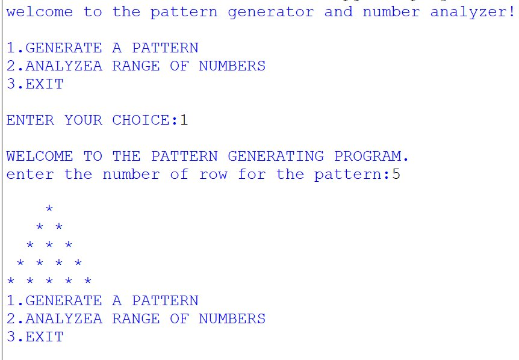
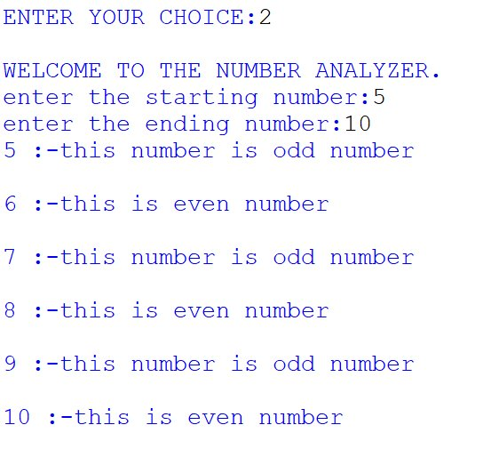
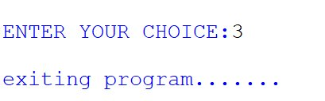

# 🔢 Pattern Generator & Number Analyzer

A simple interactive Python program that offers two utilities:
generating a star pattern and analyzing a range of numbers.

---

## 📸 Program Screenshots

### 🔹 Option 1 — Pattern Generator


### 🔹 Option 2 — Number Analyzer


### 🔹 Option 3 — Exit


---

## 📋 Features

### 1. Generate a Pattern
- Takes a number of rows as input
- Prints a right-aligned triangle of `*` symbols

### 2. Analyze a Range of Numbers
- Takes a start and end number as input
- Labels each number in the range as **even** or **odd**

### 3. Exit
- Gracefully exits the program

---

## 🚀 How to Run

Make sure you have Python 3.10+ installed (required for `match`/`case` syntax).

```bash
python pattern_and_number.py
```

---

## 🖥️ Usage

When you run the program, you'll see a menu:

```
welcome to the pattern generator and number analyzer!

1.GENERATE A PATTERN
2.ANALYZEA RANGE OF NUMBERS
3.EXIT

ENTER YOUR CHOICE:
```

### Option 1 — Pattern Generator

Enter the number of rows to generate a triangle pattern:

```
enter the number of row for the pattern: 5

        *
      * *
    * * *
  * * * *
* * * * *
```

### Option 2 — Number Analyzer

Enter a start and end number to analyze the range:

```
enter the starting number: 5
enter the ending number: 10

5 :-this number is odd number
6 :-this is even number
7 :-this number is odd number
8 :-this is even number
9 :-this number is odd number
10 :-this is even number
```

### Option 3 — Exit

```
exiting program.......
```

---

## 🛠️ Requirements

| Requirement | Version  |
|-------------|----------|
| Python      | 3.10+    |

> ⚠️ The `match`/`case` statement was introduced in **Python 3.10**. Older versions will throw a `SyntaxError`.

---

## 📁 File Structure

```
📦 project
 ┗ 📜 pattern_and_number.py
```

---

## 👤 Author

> _Add your name here_

---

## 📄 License

This project is open source and free to use.
